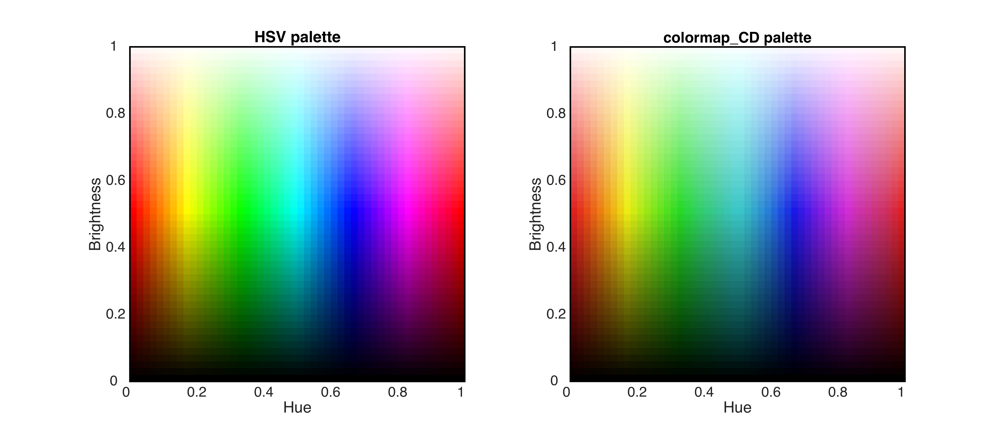

# colormap_CD V2.0

__colormap_CD__ toolbox has been upgraded to version 2.0!

The major update is the inclusion of several build-in functions that allows you to generate beautiful and clearly distinguishable color palettes without calling the __colormap_CD.m__ function.  

Advanced users can still tune __colormap_CD.m__ to customize their own color palettes that are much more distinguishable by human eyes compared with the standard Matlab colormaps.  In any cases, I guarantee that you do not need to worry about the  counter intuitive __<span style="color:rgb(255,0,0)"> R</span><span style="color:rgb(0,210,0)">G</span><span style="color:rgb(0,0,255)">B</span>__ values.  All you need to do is tell __colormap_CD.m__  what colors you want to use and how bright you want them to be!

------------------------------------

## Quick start
If you run:
```
col = r2bCD;
```
You get a nice __<span style="color:blue"> blue</span>__-to-__<span style="color:red">red </span>__ colormap:


------------------------------------

## Why should I use this toolbox?
Compared to a typical Matlab blue-to-red colormap (before), which uses saturated but very bright __<span style="color:red">red </span>__ and __<span style="color:blue"> blue</span>__ at the two ends, it is apparently much easier to read the values using __colormap_CD V2.0__  (after), especially for the __<span style="color:red">red </span>__colors.


Another example is the widely used __jet__ colormap. Compared to the default version in Matlab, besides that red is more distinguishable, __colormap_CD V2.0__ does not highlight <span style="color:rgb(240,240,0)"> yellow </span> and <span style="color:cyan"> cyan</span>, so that different hues are more balanced and the figures can be stared for a longer time without tiring your eyes.


Or if we compare with the __hot__ colormap, again colors are not distinguishable for the glaring yellow and flashing __<span style="color:red">red </span>__ (before). But __colormap_CD V2.0__ allows you to read clearly where each contour line locates.


Finally, if you want to explore the details of your data, one way that uses colormaps coming with Matlab is __lines__, which gives you a painting of Picasso...
Of course, there is no way to read any values in the left panel. But __colormap_CD V2.0__ allows you to examine the details of data easily and clearly.


<p align="center">

</p>


------------------------------------

## How to use colormap_CD V2.0

__colormap_CD V2.0__ provides several build-in functions that allows you to generate a more distinguishable and non-glaring version of most widely used colormaps. Here list all the build-in functions and their possible variations.

#### b2rCD
This function generate double-hue colormap. Run:
```
col = r2bCD;
```

You can use argmument "__num__" to choose number of colors in individual hues. Foe example:
```
col = r2bCD(9);
```

There is also a "__name__" argument, which allows to take value of "precip" and returns a colormap for precipitation anomalies:
```
col = r2bCD(6,'precip');
```


#### g2rCD
This function generate gray to red colormap, which is often the case when some part of the visualization needs to be emphasized. Run:
```
col = g2rCD;
```

Again, in all of the build-in functions, it is always available to tune the "__num__" argument. The "__name__" argument allows you to do:
```
col = g2rCD(6,'s2g');
```

```
col = g2rCD(6,'g2b');
```


#### jetCD
This function generate rainbow-like colormap. Run:
```
col = jetCD;
```

The "__name__" argument allows you to do:
```
col = jetCD(6,'season');
```

Note that this colormap starts and ends with bluish colors, which is suitable to code periodic variable, e.g. seasonal cycle (cold winter) and diurnal cycle (cold night). In addition, this colormap has two transit colors (magenta and green), which allows readers to distinguish between spring and fall or morning and afternoon.

#### hotCD
This function generate single-hue colormap. Run:
```
col = hotCD;
```

The "__name__" argument allows you to go through every major hue:
```
col = hotCD(6,'y');
```

```
col = hotCD(6,'g');
```

```
col = hotCD(6,'c');
```

```
col = hotCD(6,'b');
```

```
col = hotCD(6,'m');
```

```
col = hotCD(6,'gry');
```


#### detailCD

This function is usually called during data exploration period, which generates colormaps that distinguish between the minor changes in the value.
```
col = detailCD;
```

The "__name__" argument allows you to show details of both positive and negative values.
```
col = detailCD(6,'double');
```

Note that you can always use the following command to reverse the order of colors.
```
col = flipud(col);
```


------------------------------------
#### Q: What if none of the above colormaps is what I want?
#### A: You need to call the __colormap_CD.m__ function in __colormap_CD V2.0__ to customize your own colormap.

------------------------------------
__colormap_CD.m__ allows you take colors on a 2-D plane by changing the hue and brightness of colors. Compared to a standard Hue-Saturation-Brightness color encoding scheme, __colormap_CD.m__ fixes the saturation parameter and simplifies the process of finding colors.

A coarsened color palette used by __colormap_CD.m__ is shown below:

<p align="center">

</p>

## Input arguments of colormap_CD.m
```
RGB_out = colormap_CD(hue,brt,gry,num)
```

### Hue
Hue of colors, valid values are from 0 to 1 (see above color palette).

The dimension of hue should be a __n__ x __m__, where: __n__ is number of groups of colors, which can take value for all integers. __m__ represents number of colors in each group, which can take values in {1,2}.

__When n = 1__, the colormap has one group of hues. For example:
```
col = colormap_CD([0.16  0.89],[1 0.3],[0],12);
```

In the above example, __m = 2__, so colors in the colormap change their hue linearly from yellow to magenta. Otherwise, all colors have exactly the same hue and can only vary in brightness.

Another example would be an improved version of Matlab Autumn colormap:

```
col = colormap_CD([0.96 0.16],[0.3 0.8],[0 0],12);
```


__When n = 2__, the colormap has two groups of hues. For example, the classic blue-to-red :
```
col = colormap_CD([ 0.45 0.7; 0.08 0.95],[1 .35],[0 0],6);
```


It can also be used to generate rainbow-like palette:
```
col = colormap_CD([0.45 0.70; 0.25 0.9],[0.7 0.35],[0 0],6);
```


__when n > 3__, the colormap has multiple groups of hues, which stack the colormap of each group of hues by n times. For example, the following palette can be used to show details:
```
col = colormap_CD([0 1/6 1/3 2/3 5/6 1]',[0.9 .35],[0 0 0 0 0 1],5);
```

In this example, __m = 1__, so only one hue is allowed in each segment of the colormap.

-------------------------------------------------------------------------

### Brt
Brightness of the colors, valid values are from 0 to 1 (see above color palette).

The dimension of brt should be 1x2, which represents the brightness of colors on the two ends of each segment. For example, the following line has colormap varying from white (__brt = 1__) to dark magenta (__brt = 0.3__):
```
col = colormap_CD([0.16  0.89],[1 .3],[0],12);
```


-------------------------------------------------------------------------

### Gry
logics that determines whether certain hues are in gray scale, valid values are {0, 1}, and the size of gry should be __1__ x __n__, where n is number of groups of hues. When __gry = 1__, corresponding hues are in gray scales. For example:
```
col = colormap_CD([ 0.45 0.7; 0.08  .95],[.95 .35],[1 0],8);
col = col([1:8 10:2:end],:);
```


-------------------------------------------------------------------------

### Num
Number of colors in each hue.

-------------------------------------------------------------------------


## Why __colormap_CD V2.0__ works better
Two reasons make  __colormap_CD V2.0__  works better than default Matlab colormaps:

1. __colormap_CD V2.0__ allows users to take dark colors, brightness < 0.5, where as conventional colormaps are confined in the top half plane of the palette.  Because human eyes are more sensitive to changes in the brightness than hue, this increasing contrast makes __colormap_CD V2.0__ good at distinguishing values that are away from zero.

2. __colormap_CD V2.0__ uses a different color palette compared with a regular HSV palette that have all colors fully saturated. Show both palette side by side, grid boxes in __colormap_CD V2.0__ palette (right) more distinguishable than HSV palette (left) for nearly every hue, especially when brightness is greater than 0.5.


  * Color palette in __colormap_CD V2.0__ is achieved by decreasing the saturation for <span style="color:rgb(240,240,0)"> yellow </span>, <span style="color:rgb(0,255,0)"> green</span>, <span style="color:cyan"> cyan</span>, and <span style="color:magenta"> magenta</span>.  These colors are brighter to human eyes, even when they have the same brightness value as red or blue. As a result, the four colors glare when fully saturated and become less distinguishable.  In addition, when the saturation of these colors are decreased, the entire palette of __colormap_CD V2.0__ is more harmonic without particular part glaring. The benefit is that colormaps generated by __colormap_CD V2.0__ can be stared at a longer time.

Maintained by __Duo Chan__,Earth and Planetary Sciences, Harvard University.

Last update: 2018-08-14
