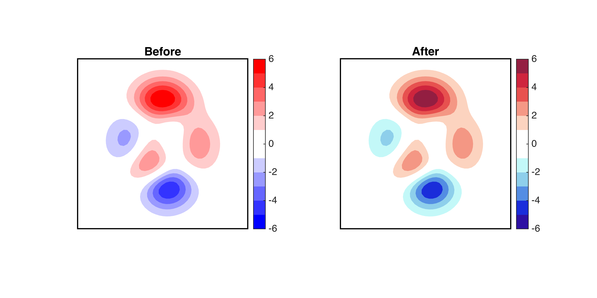
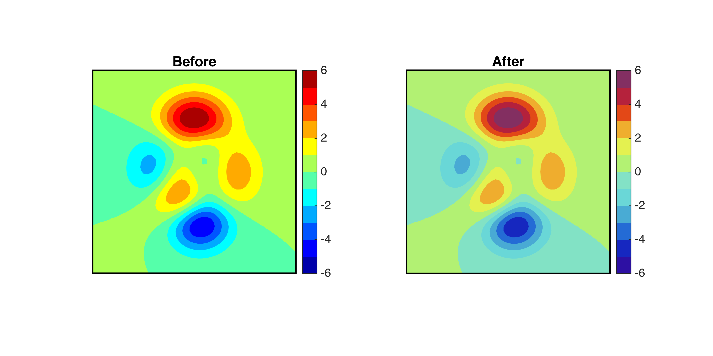
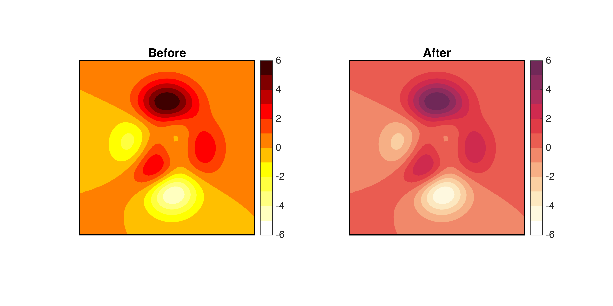
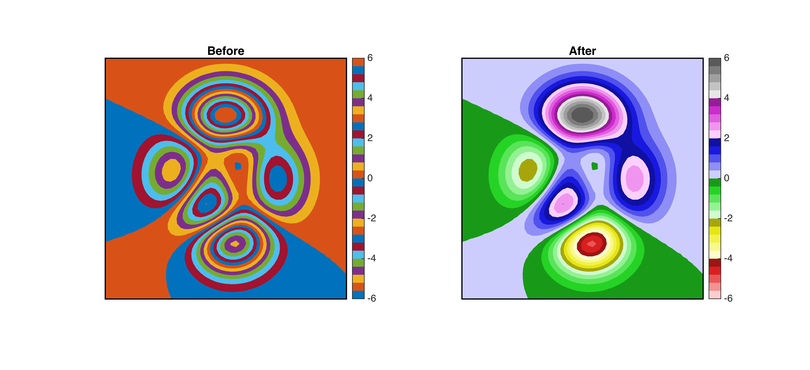
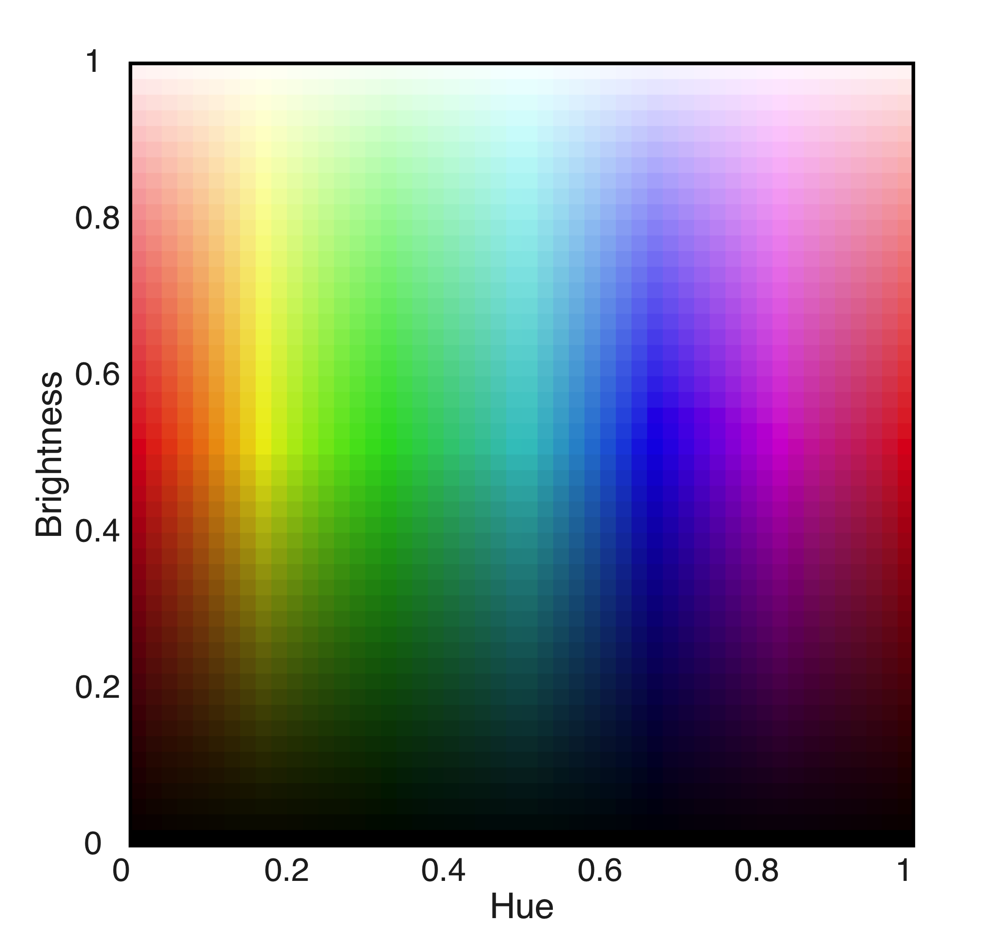
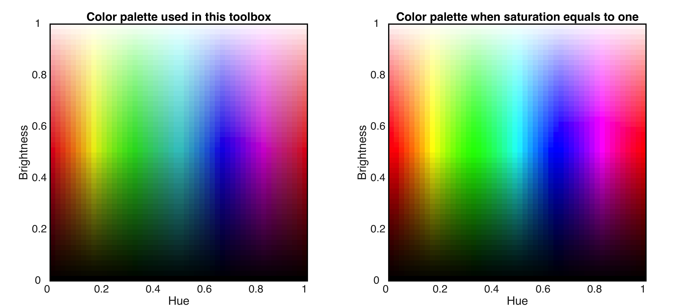

# colormap_CD

colormap_CD.m is the main function in this toolbox, which generates color palettes that are much more clearly distinguishable by human eyes compared with the standard Matlab colormaps.

## Quick start
If you run:
```
col = CDF_colormap2([0.08  .95;.45 .7],[1 .35],[0 0],6);
```
You get a nice __<span style="color:blue"> blue</span>__-to-__<span style="color:red">red </span>__ colormap:


## Why should I use this toolbox?
Compared to a typical __Matlab blue-to-red__ colormap (before), which uses saturated but very bright __<span style="color:red">red </span>__ and __<span style="color:blue"> blue</span>__ at the two ends, it is apparently much easier to read the values using __colormap_CD.m__  (after), especially for the __<span style="color:red">red </span>__colors.


Another example is the widely used __jet__ colormap. Compared to the default version in Matlab, besides that red is more distinguishable, __colormap_CD.m__ does not highlight <span style="color:rgb(240,240,0)"> yellow </span> and <span style="color:cyan"> cyan</span>, so that different hues are more balanced and the figures can be stared for a longer time without tiring your eyes.


Or if we compare with the __hot__ colormap, again colors are not distinguishable for the glaring yellow and flashing __<span style="color:red">red </span>__ (before). But __colormap_CD.m__ allows you to read clearly where each contour line locates.


Finally, if you have to explore the detail of your data, the only way that uses colormaps coming with Matlab is __lines__, which generates a painting of Picasso >_<||| But __colormap_CD.m__ allows you to examine the details of data easily and clearly.


<p align="center">

</p>


## Which colors can I use?
A coarsened color palette used by colormap_CD.m is shown below:

<p align="center">

</p>

## Input arguments
```
RGB_out = colormap_CD(hue,brt,gry,num)
```

__Hue__: hue of colors, valid values are from 0 to 1 (see above color palette).


The dimension of hue should be a __n__ by __m__, where: __n__ is number of groups of colors, which can take value for all integers. __m__ represents number of colors in each group, which can take values in {1,2}.

__When n = 1__, the colormap has one group of hues. For example:
```
col = colormap_CD([0.16  0.89],[1 .3],[0],12);
```

In the above example, __m = 2__, so colors in the colormap change their hue linearly from yellow to magenta. Otherwise, all colors can only have one hue.

Another example would be:

```
col = colormap_CD([0.96 0.16],[0.3 0.8],[0 0],12);
```


__When n = 2__, the colormap has two groups of hues. For example, the classic blue-to-red :
```
col = CDF_colormap2([0.08 0.95; 0.45 0.7],[1 0.35],[0 0],6);
```


It can also be used to generate rainbow-like palette:
```
col = colormap_CD([0.25  0.9; 0.45 0.75],[0.7 0.35],[0 0],6);
```


__when n > 3__, the colormap has multiple groups of hues, which stack the colormap of each group of hues by n times. For example, the following palette can be used to show details:
```
col = colormap_CD([0 1/6 1/3 2/3 5/6 1]',[0.9 .35],[0 0 0 0 0 1],5);
```

In this example, __m = 1__, so only one hue is allowed in each segment of the colormap.


-------------------------------------------------------------------------

__Brt__: brightness of the colors, valid values are from 0 to 1 (see above color palette).

The dimension of brt should be 1x2, which represents the brightness of colors on the two ends of each segment. For example, the following line has colormap varying from white (__brt = 1__) to dark magenta (__brt = 0.3__):
```
col = colormap_CD([0.16  0.89],[1 .3],[0],12);
```


-------------------------------------------------------------------------

__Gry__: determines whether centain hues are in gray scale, valid values are {0, 1}, and the size of gry should be 1xn, where n is number of groups of hues. When __gry = 1__, corresponding segments are in gray scales. For example:
```
col = CDF_colormap2([0.08  .95;.45 .7],[.95 .35],[0 1],8);
col = col([1:8 10:2:end],:);
```


-------------------------------------------------------------------------

__Num__: number of colors in each segment.


## Why colormap_CD.m works better
This is because the __colormap_CD.m__ uses a different color palette compared with a regular HSV palette that have all colors fully saturated. I deliberately lower the saturation for <span style="color:rgb(240,240,0)"> yellow </span>, <span style="color:rgb(0,255,0)"> green</span>, <span style="color:cyan"> cyan</span>, and <span style="color:magenta"> magenta</span>, because those colors are brighter to human eyes, even they have the same brightness value as red and blue. As a results, colormaps generated by colormap_CD.m has no particular glaring part and, therefore, can be stared at a longer time. Also, when compare __our palette (left)__ with a standard __HSV palette (right)__, grid boxes with brightness is than 0.5 are more distinguishable for nearly every hue.




Maintained by __Duo Chan__,
Harvard University.

Last update: 2018-08-06
